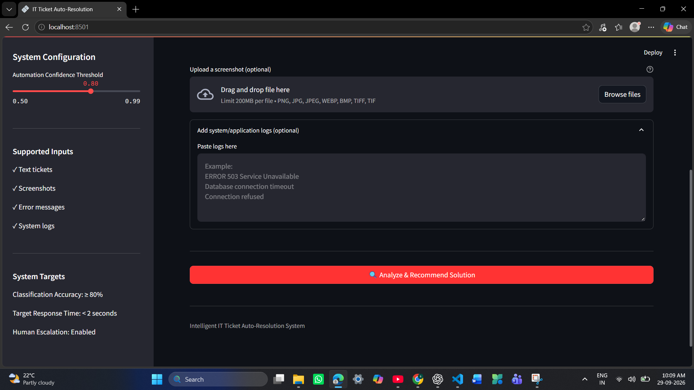
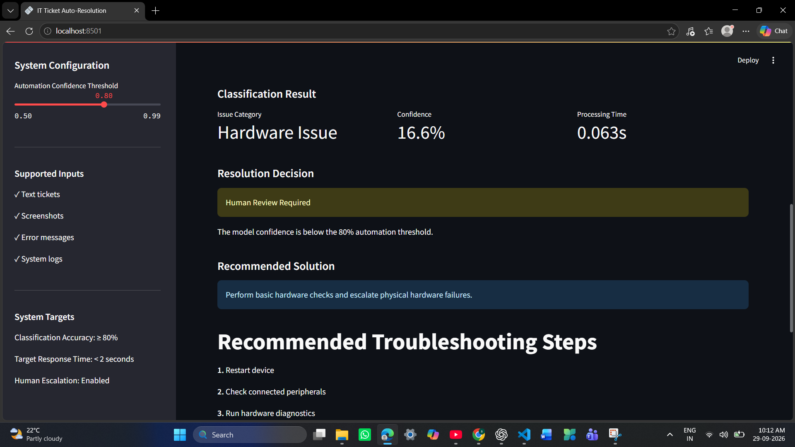
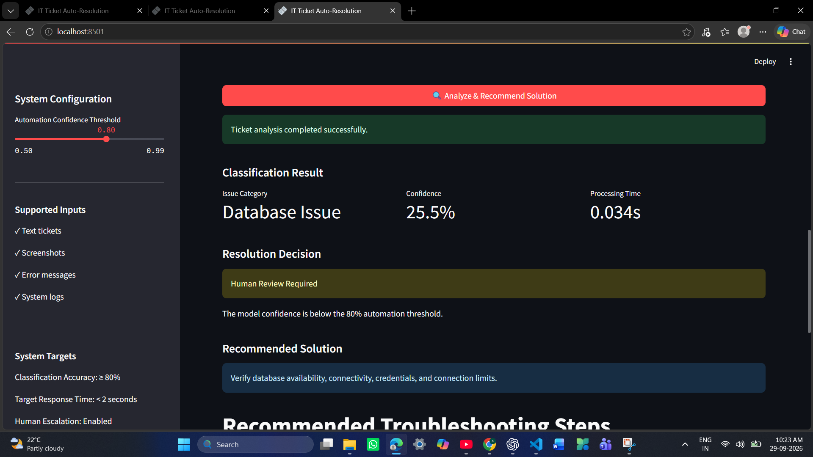

# Intelligent IT Ticket Auto-Resolution System

An  IT support automation system that classifies support tickets,
analyzes screenshots and system logs, and recommends relevant troubleshooting
solutions through an interactive Streamlit application.

# Overview

The system automates the initial IT support workflow by combining NLP-based
ticket classification, OCR-based screenshot analysis, and knowledge-based
solution recommendation.

Dataset:- This project uses a demo dataset for development, testing, and
demonstration. Enterprise-scale requirements are target specifications
from the problem statement and are not claims about this demo's performance.

# Problem Requirements

2M+ support tickets/month

5,000+ unique issue types

30% noisy or poorly written tickets

10% screenshot-based tickets

≥80% target classification accuracy


<2 seconds target response time

# Key Features

 Automated IT ticket classification

 Screenshot analysis using OCR

 System/application log analysis

 Error message processing

 Solution recommendation

 Confidence-based human escalation

 Processing-time monitoring

 Interactive Streamlit dashboard

# Supported Inputs

The application supports multiple sources of IT support information:

Text tickets 

Screenshots

Error messages  

System/application logs

### Supported Screenshot Formats


PNG • JPG • JPEG • WEBP • BMP • TIFF • TIF


# System Workflow

```text
Text / Screenshot / Error / Logs
              │
              ▼
       Input Processing
              │
              ▼
         OCR Extraction
              │
              ▼
       Text Preprocessing
              │
              ▼
      TF-IDF + ML Model
              │
              ▼
      Issue Classification
              │
              ▼
      Confidence Evaluation
              │
              ▼
    Solution Recommendation
              │
              ▼
       Streamlit Output
```

##  Machine Learning

The current demo uses a lightweight NLP pipeline:

TF-IDF — text feature extraction

Logistic Regression — ticket classification

Tesseract OCR — screenshot text extraction

Knowledge Base— troubleshooting recommendations

##  Output

# The application displays:

Predicted issue category

Confidence score

Recommended solution

Processing time

Automation / human-review status

Extracted OCR text

# Add Your Application Screenshots Here

Dashboard Output

)

Ticket Analysis Output

)

Screenshot / OCR Output

)


| Technology          | Purpose                 |
| ------------------- | ----------------------- |
| Python              | Application development |
| Scikit-learn        | Machine learning        |
| Pandas              | Data processing         |
| TF-IDF              | Text feature extraction |
| Logistic Regression | Classification          |
| Tesseract OCR       | Screenshot processing   |
| Pillow              | Image processing        |
| Streamlit           | Web application         |
| Pytest              | Testing                 |

# Project Structure

```text
intelligent-it-ticket-auto-resolution/
│
├── app.py
├── requirements.txt
├── README.md
│
├── data/
│   ├── tickets.csv
│   └── knowledge_base.csv
│
├── models/
│   ├── ticket_classifier.pkl
│   ├── tfidf_vectorizer.pkl
│   └── label_encoder.pkl
│
├── src/
│   ├── preprocessing.py
│   ├── classifier.py
│   ├── ocr_processor.py
│   ├── solution_recommender.py
│   ├── ticket_pipeline.py
│   └── train_model.py
│
├── tests/
│   ├── test_classifier.py
│   └── test_pipeline.py
│
└── images/
    ├── dashboard.png
    ├── ticket-analysis.png
    └── ocr-output.png
```

# Installation

python -m venv .venv
.venv\Scripts\activate

pip install -r requirements.txt

Install the Tesseract OCR engine separately (the `pytesseract` Python package
is only a wrapper). On Windows, install Tesseract OCR and, if it is not on your
PATH, set its executable path before starting the app:

```powershell
$env:TESSERACT_CMD = "C:\Program Files\Tesseract-OCR\tesseract.exe"
```

Use the path where `tesseract.exe` was installed on your machine.


Train the model:

python src/train_model.py

Run the Streamlit application:

streamlit run app.py


# Future Enhancements

 Transformer-based NLP models
 Semantic search and embeddings
 Vector database integration
 RAG-based solution retrieval
 Advanced model monitoring
 Cloud deployment
 Enterprise ticketing-system integration

Project:- Intelligent IT Ticket Auto-Resolution System
Interface:-Streamlit

Dataset:-Demo Dataset

# Simple text tickets

| #  | Sample IT Ticket                                           | Expected Issue Type |
| -- | ---------------------------------------------------------- | ------------------- |
| 1  | My VPN is not connecting to the company network.           | VPN                 |
| 2  | I cannot log in because my account is locked.              | Account/Login       |
| 3  | Outlook is not sending or receiving emails.                | Email               |
| 4  | The office printer is offline and cannot print.            | Printer             |
| 5  | My laptop is running extremely slowly.                     | Performance         |
| 6  | I cannot access the shared network folder.                 | Network/Access      |
| 7  | The database connection keeps timing out.                  | Database            |
| 8  | The application shows a 503 service unavailable error.     | Application/Server  |
| 9  | My password has expired and I cannot access the system.    | Password            |
| 10 | Wi-Fi keeps disconnecting from my laptop.                  | Network             |
| 11 | The company application crashes whenever I try to open it. | Application         |
| 12 | The server CPU usage is continuously above 95%.            | Server              |
| 13 | I am unable to access the internal HR portal.              | Access              |
| 14 | Teams microphone is not working during meetings.           | Collaboration       |
| 15 | My monitor is not displaying anything after connecting it. | Hardware            |


# Sample logs for your  screenshot

2026-09-28 13:05:21 ERROR Application startup failed

2026-09-28 13:05:22 ERROR HTTP Error 503 - Service Unavailable

2026-09-28 13:05:22 ERROR Database connection timeout

2026-09-28 13:05:23 ERROR Database connection refused

2026-09-28 13:05:23 WARN Application service unavailable

2026-09-28 13:05:24 ERROR Request processing failed


# System/Application Logs
add the ticket description:-The production application is not opening and shows a service unavailable error.

2026-09-28 13:05:21 ERROR Application startup failed

2026-09-28 13:05:22 ERROR HTTP Error 503 - Service Unavailable

2026-09-28 13:05:22 ERROR Database connection timeout

2026-09-28 13:05:23 ERROR Database connection refused

2026-09-28 13:05:23 WARN Application service unavailable

2026-09-28 13:05:24 ERROR Request processing failed


# Large-Scale Dataset Processing

For large IT ticket datasets, the system can follow this processing pipeline:

1. Data Ingestion
    Load tickets from CSV, database, or enterprise ticketing systems.
    Process data in batches instead of loading everything into memory.

2. Data Cleaning
    Remove duplicate tickets.
    Handle missing values.
    Normalize text.
    Remove unnecessary characters and noise.

3. Data Preprocessing
    Combine ticket descriptions, error messages, and logs.
    Extract text from screenshots using OCR.
    Normalize technical terms and error codes.

4. Feature Extraction
    Convert cleaned ticket text into numerical features using TF-IDF.
    For larger-scale production systems, use embeddings for semantic search.

5. Dataset Splitting
    Training set
    Validation set
    Test set

6. Model Training
    Train the ticket classification model using the processed data.
    Use batch processing and optimized algorithms for large datasets.

7. Model Evaluation
    Accuracy
    Precision
    Recall
    F1-score
    Confusion matrix
    Inference latency

8. Model Optimization
    Remove unnecessary features.
    Tune model parameters.
    Optimize preprocessing and inference.

9. Deployment
    Save the trained model and preprocessing components.
    Load them during application startup.
    Use Streamlit for the application interface.

10. Monitoring
     Monitor prediction accuracy.
     Monitor response time.
     Track low-confidence predictions.
     Monitor new or previously unseen issue types.

    # Live Link:-https://intelligent-it-ticket-auto-resolution-system-hbjs2sbje92b3a3av.streamlit.app/

